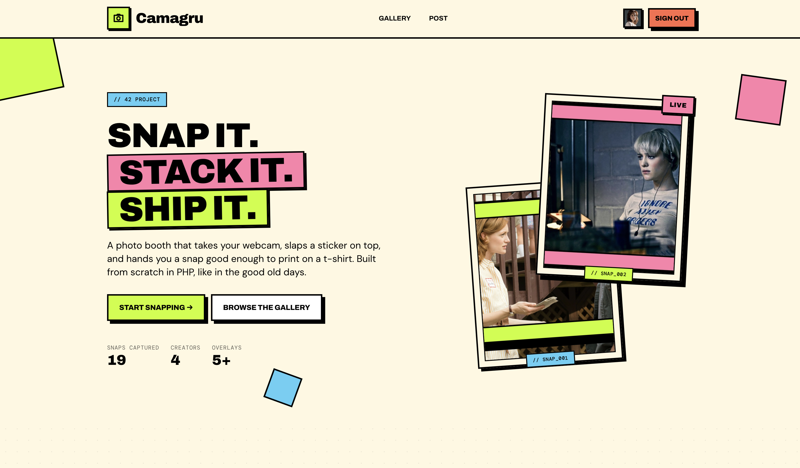

# Camagru


A web-based photobooth application built as a **42 school project** (subject v4.1).

Users capture photos via webcam (or upload an image), overlay them with selectable PNG stickers (alpha channel), and the server merges both images into a final composition. All creations are displayed in a public gallery where users can like and comment.



## Tech Stack

| Component        | Choice                                    |
|------------------|-------------------------------------------|
| Server           | PHP (standard library only, no framework) |
| Architecture     | MVC from scratch                          |
| CSS              | Tailwind CSS (CLI build, static output)   |
| Database         | MySQL via PDO (prepared statements)       |
| Image processing | GD (PHP extension)                        |
| Email            | Native `mail()`                           |
| Web server       | Nginx                                     |
| Containerization | Docker + docker-compose                   |
| JavaScript       | Vanilla JS (browser native APIs only)     |

## Features

### Mandatory

- **User management** — Registration with email confirmation, login, logout, password reset, profile editing
- **Photo editor** — Webcam capture or image upload, overlay selection, server-side image merging (GD)
- **Public gallery** — Paginated display of all creations, likes and comments (authenticated users only)
- **Email notifications** — Author notified on new comments (opt-out in preferences)
- **Security** — bcrypt passwords, prepared statements, CSRF tokens, XSS protection, upload validation
- **Docker** — Single `docker-compose up` deploys the full stack

### Bonus

- **AJAX interactions** — All exchanges via native `fetch()` (likes, comments, captures, delete)
- **Live overlay preview** — Real-time overlay rendering on the webcam stream (canvas + `requestAnimationFrame`)
- **Infinite scroll** — Optional toggle on the gallery (`IntersectionObserver` + AJAX feed)
- **Social sharing** — Share to X (Twitter) + copy-to-clipboard, with Open Graph meta tags

## Getting Started

```bash
git clone git@github.com:Wormav/42_Camagru.git
cd 42_Camagru
cp .env.example .env
# Edit .env with your credentials
make all
```

The application will be available at `http://localhost:8080`.

### Useful commands

```bash
make all           # Build CSS, JS, images and start docker-compose
make clean         # Stop containers (keeps volumes)
make fclean        # Stop + drop volumes + wipe local images and uploads
make logs          # Tail container logs
make shell         # Shell inside the PHP container
make db            # MySQL shell inside the db container
make fake          # Restore the demo dataset (seeded users + snaps)
make tailwind      # Rebuild minified CSS
make js            # Concat JS bundles into public/dist/
```

## Project Constraints

This project follows strict rules imposed by the 42 subject:

- **No PHP frameworks** (Symfony, Laravel, etc.)
- **No JS libraries** (jQuery, React, etc.)
- **No ORM** — raw PDO only
- **CSS frameworks allowed** only if they don't include JavaScript
- All server-side functions must have an equivalent in the PHP standard library
- Compatible with Firefox >= 41 and Chrome >= 46

## License

This project is a 42 school assignment and is not intended for production use.
